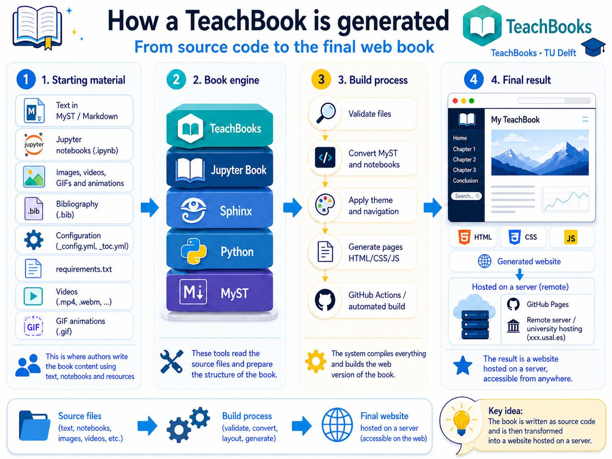

# 1. What is a TeachBook?

A **TeachBook** is a digital teaching book built from text files, code, and multimedia resources, which are then compiled into a **navigable website** and, in many cases, also a **PDF version**.

In simple terms:

- you edit the **source content**
- the system **builds** it
- you get a **clean, functional, publishable** book

````{only} html
```{raw} html
<figure class="align-center">
  <picture>
    <source srcset="../../_static/images/1_Que_es_un_teachbook_en.webp" type="image/webp">
    
  </picture>
  <figcaption>A TeachBook starts from editable content and produces a publishable teaching website.</figcaption>
</figure>
```
````

````{only} latex
```{figure} ../../_static/images/1_Que_es_un_teachbook_en.png
---
name: fig-what-is-a-teachbook
alt: Visual overview of what a TeachBook is
width: 85%
align: center
---
A TeachBook starts from editable content and produces a publishable teaching website.
```
````

## Attribution and origin

This template is built on the original ecosystem of:

- [TeachBooks](https://teachbooks.io/)
- [Jupyter Book](https://jupyterbook.org/)

This specific adaptation has been prepared for the **Faculty of Sciences at the University of Salamanca (USAL)**.

This matters: **we are not starting from scratch**. We are starting from existing, tested, maintained tools, and building a teaching-focused template on top of them.

## What goes in and what comes out

The core idea is this:


The following table summarizes the main elements of this section.

**Table. What goes in and what comes out.**

| You start with... | And you get... |
|---|---|
| `.md` and `.ipynb` files | book web pages |
| images, bibliography, and static assets | enriched content |
| book configuration (`_config_*.yml`) | navigation, theme, language, extensions |
| table of contents (`_toc_*.yml`) | visible book structure |

## Why this is useful for teaching

1. **Accessibility**: the book can be read on the web from any device.
2. **Reproducibility**: the content comes from source files that can be versioned.
3. **Maintainability**: updating a page is easier than rebuilding a whole set of notes.
4. **Scalability**: you can start with one page and grow gradually.
5. **Compatibility**: the same project can produce both web and PDF outputs.

## What this template adds on top of the original base

On top of TeachBooks / Jupyter Book, this project adds several practical improvements for teachers and students:

### 1. Multilingual structure

The book is prepared to work in:

- Spanish
- English

with synchronized content and table of contents structure.

### 2. PDF export

Besides the website, this template also supports a PDF output for printing or offline distribution.

### 3. Simple automation scripts

You do not need a complicated workflow on day one. The project includes scripts to:

- prepare the environment
- build the website
- open live preview
- export PDF
- convert PDF to Markdown

### 4. AI agent integration

The template is prepared so an agent can help you:

- create content
- reorganize chapters
- add multimedia
- maintain the structure of the book

## What a TeachBook is NOT

It is not:

- a PowerPoint presentation
- a React-style web app with heavy JS frameworks
- a static PDF pretending to be a website

The main idea is that the content remains **editable, structured, and reusable**.

## Practical advice to start

Do not try to build a huge book on the first day.

Start small:

- a cover page
- one short chapter
- one image
- one equation
- one section with two or three pages

Once that works well, expand.
